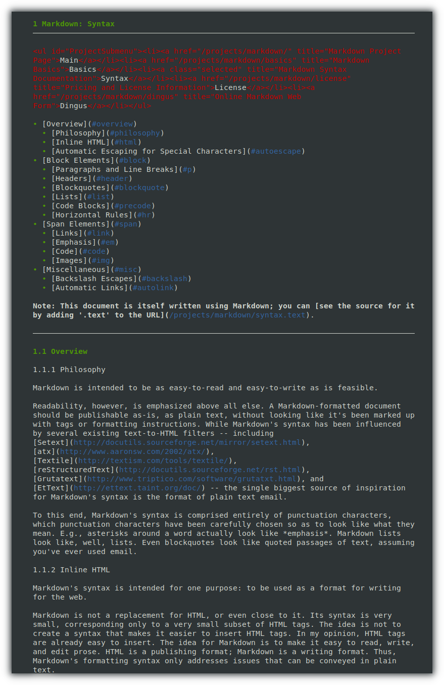
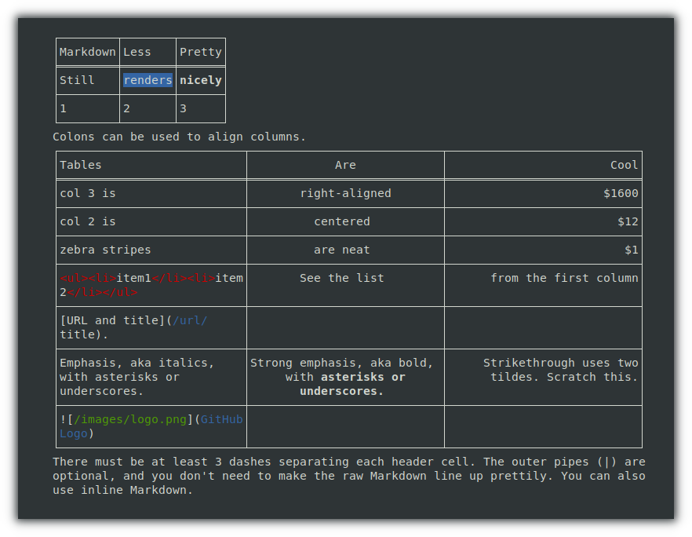
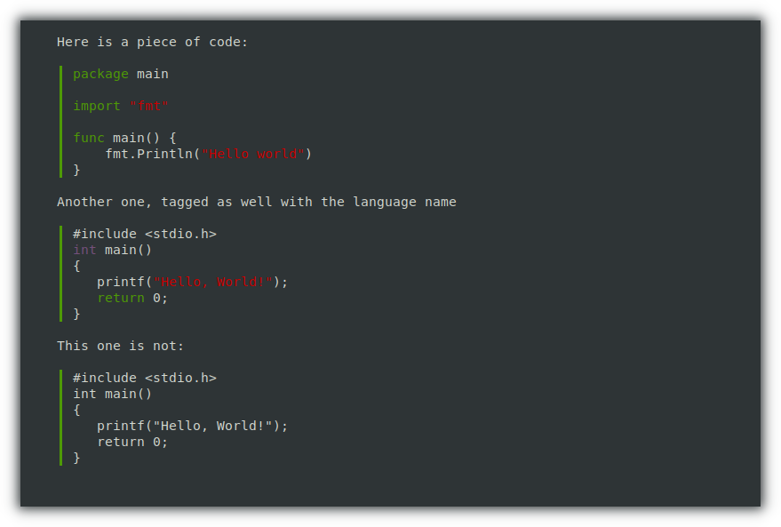

# bleamd - Markdown Renderer & Search

[](https://github.com/guttermonk/bleamd/blob/master/LICENSE)
[](https://github.com/guttermonk/bleamd/stargazers)

A powerful standalone Markdown renderer for the terminal with advanced search, hyperlink support, and extensive customization options.

## 🚀 New & Notable Features

- 🔗 **Clickable Hyperlinks** - OSC 8 terminal hyperlinks that open in your browser
- 🔍 **Advanced Search** - Full-text search with smart highlighting and match navigation
- ❓ **Interactive Help** - Press `?` for instant keybinding reference popup
- 🎨 **Rich Theming** - Multiple built-in themes plus full color customization
- ⌨️ **Custom Keybindings** - Configure every keyboard shortcut to your preference
- 🖱️ **Mouse Support** - Click and scroll support in compatible terminals
- ⚡ **Vim Bindings** - Native support for Vim bindings using Qwerty and Colemak-DH layouts

## Features

- 📖 Beautiful Markdown rendering in your terminal
- 🔍 **Intelligent full-text search** with highlighting (Ctrl+F)
  - Current match highlighted in bright orange
  - All matches highlighted in yellow
  - Match counter in status bar
  - Navigate with `n`/`N` (next/previous)
- 🔗 **Clickable hyperlinks** - Links are underlined and clickable in supported terminals
- ⌨️ **Fully customizable keybindings** - Vim-like defaults with Colemak-DH support
- ❓ **Interactive help popup** - Press `?` to see all available keybindings
- 🎨 **Advanced theming system**
  - 4 built-in themes (One Dark, Dracula, Solarized Dark, Catppuccin Latte)
  - Full color customization for all elements
  - ANSI 256 color support
- 🖱️ **Mouse support** - Scroll and interact with compatible terminals
- 📊 **Rich table rendering** with proper borders and alignment
- 💻 **Syntax highlighting** for code blocks
- ❄️ **Native NixOS support** with flakes and development shell

## Installation

### Binary Release
Download a [pre-compiled binary](https://github.com/guttermonk/bleamd/releases/latest) for your platform.

### NixOS / Nix
```bash
# Run directly
nix run github:guttermonk/bleamd -- README.md

# Install to profile
nix profile install github:guttermonk/bleamd

# Build locally
git clone https://github.com/guttermonk/bleamd
cd bleamd
nix build
./result/bin/bleamd README.md
```

### From Source
```bash
git clone https://github.com/guttermonk/bleamd
cd bleamd
go build
./bleamd README.md
```

## Usage

```bash
bleamd README.md                  # Render a markdown file
bleamd < file.md                  # Read from stdin
curl example.com/file.md | bleamd # Pipe from network
bleamd --init-config              # Create default config file
bleamd --config-path              # Show config file location
```

## Keybindings

Press `?` at any time to display an interactive help popup with all available keybindings. All keybindings are fully configurable via the config file.

### Default Navigation Keys
| Key | Action |
|-----|--------|
| `↑` `k` `i` | Scroll up |
| `↓` `j` `e` | Scroll down |
| `←` `h` | Scroll left |
| `→` `l` `o` | Scroll right |
| `PgUp` | Page up |
| `PgDn` `Space` | Page down |
| `g` | Go to top |
| `G` | Go to bottom |
| `?` | **Show interactive help** |
| `q` `Ctrl+C` | Quit |

### Search Features
| Key | Action |
|-----|--------|
| `Ctrl+F` `/` | Start search |
| `Enter` | Execute search |
| `n` | Next match |
| `N` | Previous match |
| `ESC` | Clear search/Cancel |

**Search highlights:**
- 🟠 **Current match**: Bright orange background
- 🟡 **Other matches**: Yellow text
- 📊 **Status bar**: Shows "Match X of Y" with search term

### Hyperlinks
Links in your markdown are automatically converted to clickable hyperlinks in compatible terminals:
- Underlined and styled according to your theme
- Click to open in your default browser
- Works with http/https URLs and mailto links

## Configuration & Theming

Create and customize your configuration:

```bash
bleamd --init-config      # Create default config with One Dark theme
bleamd --config-path      # Show config file location
```

### Pre-built Themes

Choose from professionally designed themes:

```bash
# One Dark (default)
cp themes/one-dark.json ~/.config/bleamd/config.json

# Dracula
cp themes/dracula.json ~/.config/bleamd/config.json

# Solarized Dark  
cp themes/solarized-dark.json ~/.config/bleamd/config.json

# Catppuccin Latte (light theme)
cp themes/catppuccin-latte.json ~/.config/bleamd/config.json
```

### Custom Keybindings

Configure your preferred keybindings in `~/.config/bleamd/config.json`. Each action supports multiple key combinations:

```json
{
  "keybindings": {
    "scroll_up": ["k", "i", "Up", "C-p"],
    "scroll_down": ["j", "e", "Down", "C-n"],
    "scroll_left": ["h", "Left"],
    "scroll_right": ["l", "o", "Right"],
    "page_up": ["PageUp"],
    "page_down": ["PageDown", "Space"],
    "go_to_top": ["g"],
    "go_to_bottom": ["G"],
    "start_search": ["/", "C-f"],
    "next_match": ["n"],
    "prev_match": ["N"],
    "clear_search": ["Escape"],
    "quit": ["q", "C-c"],
    "show_help": ["?"]
  }
}
```

**Supported key formats:**
- Single characters: `"k"`, `"j"`, `"h"`, `"l"`
- Arrow keys: `"Up"`, `"Down"`, `"Left"`, `"Right"`
- Special keys: `"PageUp"`, `"PageDown"`, `"Space"`, `"Enter"`, `"Escape"`
- Control combinations: `"C-f"`, `"C-c"`, `"C-n"`, `"C-p"`

### Advanced Color Customization

Customize every visual element in your config file:

```json
{
  "colors": {
    "heading1": "#61afef",
    "heading2": "#c678dd", 
    "bold": "#abb2bf",
    "italic": "#98c379",
    "code": "#e5c07b",
    "link": "#56b6c2",
    "search_current": "#d19a66",
    "search_match": "#e5c07b",
    "search_box_border": "#ff5fff",
    "help_box_border": "#5f87d7",
    "hovered_link_url": "#00ffff",
    "hyperlink_underline": "#56b6c2",
    "hyperlink_hovered_underline": "#e5c07b"
  }
}
```

**Customizable elements:**
- **Headings**: `heading1` through `heading6`  
- **Text**: `bold`, `italic`, `strikethrough`
- **Code**: `code`, `code_block`, `code_block_bg`
- **Links**: `link`, `link_url`
- **Lists**: `list_marker`, `task_checked`, `task_unchecked`
- **Layout**: `blockquote`, `table_header`, `table_row`, `table_border`
- **Search**: `search_current`, `search_match`
- **UI**: `status_bar_text`, `status_bar_bg`, `search_box_border`, `help_box_border`, `hovered_link`

All colors use hex format (e.g., `#ff0000`) and are automatically converted to the nearest ANSI 256 color for terminal display.

## Development

### Nix Development Shell
```bash
nix develop  # Or use direnv with the included .envrc
go build
go test ./...
```

### Traditional Development
```bash
go mod download
make build
```

The development environment includes Go, gopls, golangci-lint, and other useful tools.

## Examples

Check out the visual examples in the `examples/` directory:





## Contributing

PRs welcome! When contributing:

1. Use the Nix development shell for consistent tooling
2. Run tests with `go test ./...`
3. Update vendor hash in `flake.nix` if dependencies change
4. Test with different themes and keybinding configurations

## License

MIT

## FAQ

### How does bleamd compare to other markdown viewers?

| Feature | bleamd | [Glow](https://github.com/charmbracelet/glow/) | [mdr](https://github.com/MichaelMure/mdr/) | [mdv](https://github.com/axiros/terminal_markdown_viewer) | [Grip](https://github.com/joeyespo/grip) | [Pandoc](https://github.com/jgm/pandoc) |
|---------|--------|------|-----|-----|------|--------|
| **Interactive TUI** | ✅ | ✅ | ✅ | ❌ | ❌ | ❌ |
| **Full-text search** | ✅ | ✅ | ❌ | ❌ | ❌ | ❌ |
| **Clickable hyperlinks** | ✅ | ❌ | ❌ | ❌ | ✅ | ❌ |
| **Custom keybindings** | ✅ | ❌ | ❌ | ❌ | ❌ | ❌ |
| **Multiple themes** | ✅ | ✅ | ❌ | ✅ | ✅ | ❌ |
| **Mouse support** | ✅ | ✅ | ❌ | ❌ | ✅ | ❌ |
| **File management** | ❌ | ✅ | ❌ | ❌ | ❌ | ❌ |
| **Cloud sync** | ❌ | ✅ | ❌ | ❌ | ❌ | ❌ |
| **Live reload** | ❌ | ❌ | ❌ | ❌ | ✅ | ❌ |
| **Format conversion** | ❌ | ❌ | ❌ | ❌ | ❌ | ✅ |
| **Terminal-native** | ✅ | ✅ | ✅ | ✅ | ❌ | ✅ |
| **Offline support** | ✅ | ✅ | ✅ | ✅ | ❌ | ✅ |
| **Language** | Go | Go | Go | Python | Python | Haskell |

**bleamd's niche**: Fast, interactive terminal viewer with powerful search, full customization, and clickable links for terminal-centric workflows.

## Origin

This tool is a fork of [mdr](https://github.com/MichaelMure/mdr) with extensive enhancements including:
- Advanced search functionality with highlighting
- Hyperlink support (OSC 8)
- Interactive help system
- Configurable keybindings
- Rich theming system
- Mouse support
- Colemak-DH keyboard layout support

Perfect for developers, writers, and anyone who works with Markdown files in the terminal.
